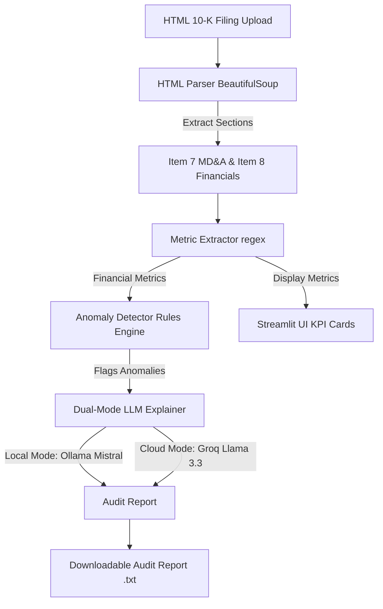

# 🔍 LLM-Powered Financial Auditor

[](https://streamlit.io)
[](https://python.org)
[](https://ollama.ai)
[](https://groq.com)

An automated tool to parse SEC 10-K financial filings, extract key performance metrics, check for rule-based anomalies, and generate AI-driven audit explanations.

---

## 🏛️ System Architecture



---

## 🌟 Key Features

- **HTML 10-K Parser:** Parses SEC EDGAR HTML filings using BeautifulSoup and extracts section headers like Item 7 (Management's Discussion & Analysis) and Item 8 (Financial Statements).
- **Regex Metric Extraction:** Auto-extracts critical financial metrics (Revenue, Net Income, Operating Expenses, Gross Profit, Total Assets, Total Liabilities).
- **Anomaly Detection Rules Engine:** Evaluates metrics against standard auditing heuristics:
  - **Negative Net Income** (indicating net loss).
  - **Overspending** (Operating Expenses > Revenue).
  - **Low Gross Profit Margin** (< 20%).
  - **High Leverage** (Total Liabilities > 80% of Total Assets).
- **Dual-Mode AI Explainer:**
  - **Local Mode:** Performs offline explanation inference using a local Mistral model via [Ollama](https://ollama.ai/).
  - **Cloud Mode:** Runs blazing-fast serverless inference using a Llama 3.3 70B model via the [Groq Cloud API](https://groq.com/).
- **Interactive UI Dashboard:** Built with Streamlit, presenting custom color-coded severity alerts, KPI cards, collapsible raw source inspect views, and one-click TXT report exports.

---

## 📁 Project Structure

Below is the repository layout. Click any file link to view the implementation details directly:

- 🔍 **Main Entrypoint:**
  - [`app.py`](file:///c:/Users/agbad/OneDrive/Desktop/vick/Project%20Assistant/llm_powered_financial_auditor/app.py) — The Streamlit application UI, report generation, and layout.
- 📦 **Dependencies:**
  - [`requirements.txt`](file:///c:/Users/agbad/OneDrive/Desktop/vick/Project%20Assistant/llm_powered_financial_auditor/requirements.txt) — Project package requirements.
- ⚙️ **Git Configuration:**
  - [`.gitignore`](file:///c:/Users/agbad/OneDrive/Desktop/vick/Project%20Assistant/llm_powered_financial_auditor/.gitignore) — Configured to protect environment files (`.env`) and local Streamlit secrets.
- 📂 **[`extraction`](file:///c:/Users/agbad/OneDrive/Desktop/vick/Project%20Assistant/llm_powered_financial_auditor/extraction) (Data ingestion & extraction):**
  - [`parse_html.py`](file:///c:/Users/agbad/OneDrive/Desktop/vick/Project%20Assistant/llm_powered_financial_auditor/extraction/parse_html.py) — Parser to structure SEC 10-K HTML reports into clean textual sections.
  - [`extract_metrics.py`](file:///c:/Users/agbad/OneDrive/Desktop/vick/Project%20Assistant/llm_powered_financial_auditor/extraction/extract_metrics.py) — Text miner that targets and formats metrics using specific regex patterns.
- 📂 **[`anomaly_detection`](file:///c:/Users/agbad/OneDrive/Desktop/vick/Project%20Assistant/llm_powered_financial_auditor/anomaly_detection) (Rules engine):**
  - [`rules.py`](file:///c:/Users/agbad/OneDrive/Desktop/vick/Project%20Assistant/llm_powered_financial_auditor/anomaly_detection/rules.py) — Declares heuristic rules, severity logic, and flags anomalies.
- 📂 **[`llm_module`](file:///c:/Users/agbad/OneDrive/Desktop/vick/Project%20Assistant/llm_powered_financial_auditor/llm_module) (AI Explanations):**
  - [`explainer.py`](file:///c:/Users/agbad/OneDrive/Desktop/vick/Project%20Assistant/llm_powered_financial_auditor/llm_module/explainer.py) — Handles prompt templates and schedules requests to Ollama or Groq API.
  - [`pipeline.py`](file:///c:/Users/agbad/OneDrive/Desktop/vick/Project%20Assistant/llm_powered_financial_auditor/llm_module/pipeline.py) — Local validation pipeline script.

---

## 🚀 Getting Started

### 1. Prerequisites
Ensure you have the following installed:
- **Python 3.8+**
- **Ollama** (for local offline mode)

---

### 2. Local Setup & Execution

#### Step A: Clone the Repository & Install Dependencies
```bash
git clone <your-repository-url>
cd llm_powered_financial_auditor
pip install -r requirements.txt
```

#### Step B: Choose Your LLM Mode

##### Option 1: Local Offline Inference (Default)
1. Install and start [Ollama](https://ollama.ai/).
2. Pull the Mistral model in a separate terminal:
   ```bash
   ollama pull mistral
   ```
3. Run the Streamlit application:
   ```bash
   streamlit run app.py
   ```

##### Option 2: Cloud Inference (Groq)
To run with cloud inference, create a Streamlit secrets file `.streamlit/secrets.toml` in your root directory (which is automatically excluded from git tracking via `.gitignore`):
```toml
# .streamlit/secrets.toml
LLM_MODE = "cloud"
GROQ_API_KEY = "your-groq-api-key-here"
```
Or define them inside a `.env` file:
```ini
LLM_MODE=cloud
GROQ_API_KEY=your-groq-api-key-here
```

---

## ☁️ Deployment (Streamlit Community Cloud)

When deploying to [Streamlit Community Cloud](https://share.streamlit.io):

1. Commit and push your code to a GitHub repository (excluding local credentials like `.env` and `.streamlit/secrets.toml`).
2. Link your repository in the Streamlit Cloud dashboard.
3. Access your app settings panel, select **Secrets**, and paste the API parameters directly:
   ```toml
   LLM_MODE = "cloud"
   GROQ_API_KEY = "gsk_your_actual_groq_api_key"
   ```
4. Click **Save** and deploy. Streamlit will inject these as environment variables automatically!

---

## 🤝 Author
Built by [Victor Agbadan](https://github.com/vickCoder7)
