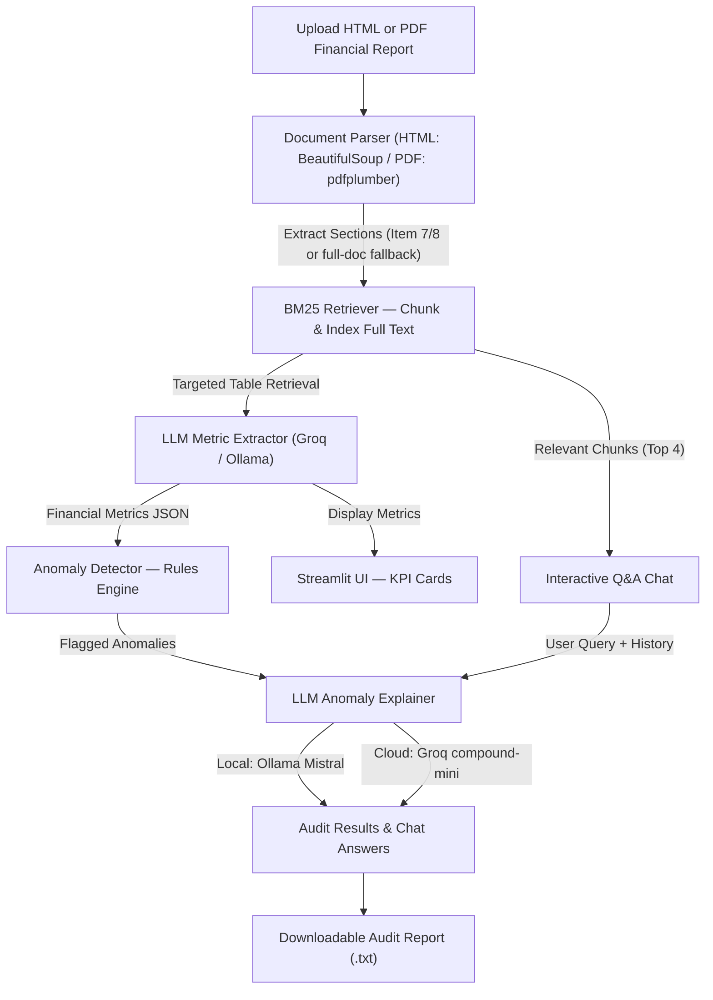

# LLM-Powered Financial Auditor

[](https://streamlit.io)
[](https://python.org)
[](https://ollama.ai)
[](https://groq.com)

An automated financial document auditor that parses HTML and PDF financial reports, extracts key performance metrics using a **Retrieval-Augmented Generation (RAG)** pipeline, flags anomalies with a rule-based engine, and generates AI-powered audit explanations. Supports SEC EDGAR filings (10-K, 10-Q) as well as general annual reports.

App: https://llm-financial-auditor.streamlit.app/

---

## 🏛️ System Architecture



---

## Key Features

> ### Multi-Format Document Parsing
Supports two input formats — both route through the same downstream pipeline:
- **HTML** (`parse_html.py`): Parses SEC EDGAR HTML filings using BeautifulSoup, extracting `Item X.` section headers. Falls back to the full document if no headers are found.
- **PDF** (`parse_pdf.py`): Extracts page-by-page text using `pdfplumber`, applies the same `Item X.` section detection, and falls back to page-level sections for general financial PDFs.

> ### BM25 Retrieval-Augmented Generation (RAG)
Instead of blindly truncating or sending the entire document to the LLM, the application uses an in-memory **Okapi BM25** search index (implemented in pure Python with no external dependencies):
- The full document text is chunked into overlapping 3,000-character windows and indexed on upload.
- For **metric extraction**, the retriever runs two targeted queries — one for the Income Statement and one for the Balance Sheet — retrieving only the actual financial tables (~3,000–5,000 characters).
- For **interactive chat**, the retriever retrieves the top 4 most relevant chunks for every user question, enabling full-document coverage without breaking token limits.

> ### LLM-Powered Metric Extraction
Extracts 6 key financial metrics for the most recent fiscal year from retrieved table chunks:
- Revenue, Net Income, Gross Profit, Operating Expenses, Total Assets, Total Liabilities.
- Handles semantic label variation (e.g. `"Net sales"` vs `"Revenue"`), unit scale normalization (thousands / millions / billions), and parenthetical negatives automatically.

> ### Anomaly Detection Rules Engine
Evaluates extracted metrics against standard auditing heuristics:
- **Negative Net Income** — indicates a net loss.
- **Overspending** — Operating Expenses exceed Revenue.
- **Low Gross Profit Margin** — margin below 20%.
- **High Leverage** — Total Liabilities exceed 80% of Total Assets.

> ### Dual-Mode AI Explainer & Chat
- **Local Mode (Ollama):** Offline inference using a local Mistral model. Because RAG retrieves only compact, targeted context, local models can now perform both metric extraction and chat Q&A accurately and quickly.
- **Cloud Mode (Groq):** High-speed serverless inference using `groq/compound-mini` (70,000 TPM limit — chosen specifically for its generous free-tier rate limits) or any other Groq-compatible model set via `MODEL_NAME`.
- **Auto Rate-Limit Handling:** The `client.py` LLM client automatically parses Groq `429` responses, extracts the exact retry wait time from response headers or error messages, and retries up to 5 times with a small safety buffer. A Streamlit toast notification keeps the user informed.

> ### 💬 Interactive Document Q&A
A conversational audit assistant for asking questions about any part of the uploaded report:
- Maintains a rolling 5-message conversation history.
- Resets automatically when a new file is uploaded.
- Answers are grounded exclusively in the retrieved document context — no hallucinated facts.

---

## 📁 Project Structure

```
llm_powered_financial_auditor/
├── app.py                          # Streamlit UI — orchestrates the full pipeline
├── requirements.txt                # Python package dependencies
├── .env                            # Local secrets (not committed)
│
├── extraction/
│   ├── parse_html.py               # HTML parser (BeautifulSoup + SEC Item detection)
│   ├── parse_pdf.py                # PDF parser (pdfplumber + SEC Item detection)
│   └── extract_metrics.py          # RAG-based LLM metric extractor
│
├── anomaly_detection/
│   └── rules.py                    # Heuristic anomaly detection rules engine
│
└── llm_module/
    ├── client.py                   # Unified LLM client (Ollama + Groq, rate-limit retries)
    ├── retriever.py                # Pure-Python BM25 retriever + text chunker
    └── explainer.py                # Prompt templates for anomaly explanation & Q&A
```

---

## Getting Started

### 1. Prerequisites
- **Python 3.8+**
- **Ollama** (only required for local offline mode)

### 2. Local Setup & Execution

> #### Step A: Clone & Install
```bash
git clone https://github.com/vickCoder7/llm_powered_financial_auditor.git
cd llm_powered_financial_auditor
pip install -r requirements.txt
```

#### Step B: Choose Your LLM Mode

##### Option 1: Local Offline Inference (Default)
1. Install and start [Ollama](https://ollama.ai/).
2. Pull the Mistral model:
   ```bash
   ollama pull mistral
   ```
3. Run the app:
   ```bash
   streamlit run app.py
   ```

##### Option 2: Cloud Inference via Groq
Create a `.env` file in the project root:
```ini
LLM_MODE=cloud
GROQ_API_KEY=your-groq-api-key-here
```
Or use Streamlit secrets (`.streamlit/secrets.toml`) for cloud deployments:
```toml
LLM_MODE = "cloud"
GROQ_API_KEY = "your-groq-api-key-here"
```
Then run:
```bash
streamlit run app.py
```

> **Note:** The default cloud model is `groq/compound-mini`, which has a **70,000 TPM** rate limit on the Groq free tier. You can override the model by setting `MODEL_NAME=<model-id>` in your `.env` file.

### 3. Uploading a Report
Upload any **HTML or PDF** financial report using the file uploader in the app. Supported formats:
- SEC EDGAR HTML filings (10-K, 10-Q) — download directly from [EDGAR](https://www.sec.gov/cgi-bin/browse-edgar)
- PDF annual reports or financial statements from any publicly listed company

---

## 🤝 Author
Built by [Victor Agbadan](https://github.com/vickCoder7)
